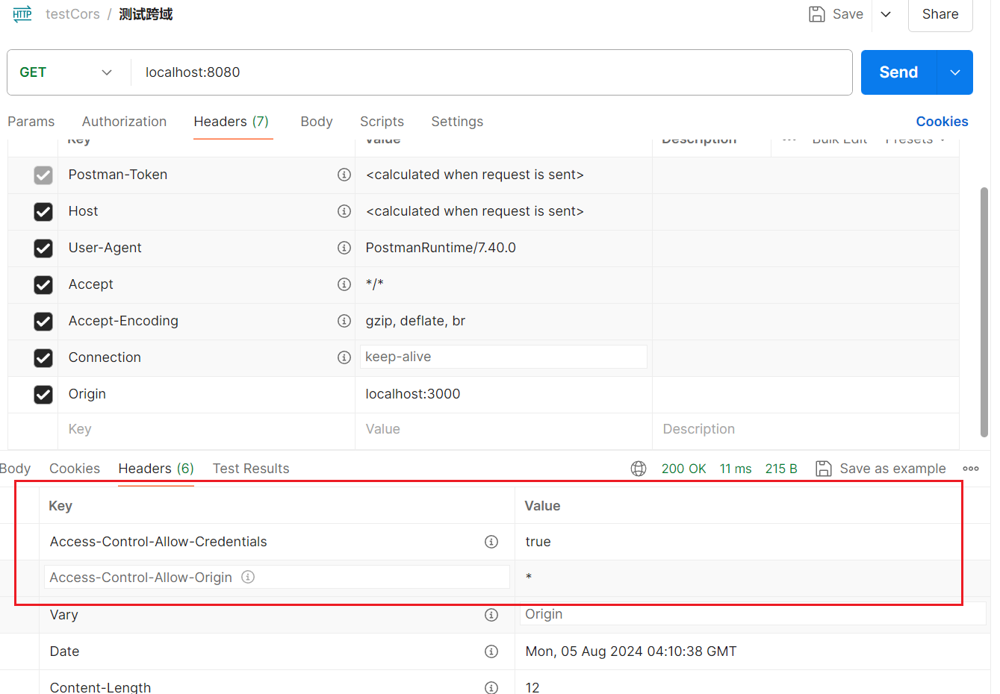

# cors
一个Go语言跨域中间件，包含gin等框架中间件

## 使用
```go
        mux := http.NewServeMux()
	mux.HandleFunc("/", func(w http.ResponseWriter, r *http.Request) {
		if r.Method != "GET" {
			w.WriteHeader(http.StatusMethodNotAllowed)
		}
		w.Write([]byte("Hello World!"))
	})
	handle := cors.Default().Handler(mux)
	http.ListenAndServe(":8080", handle)
```


